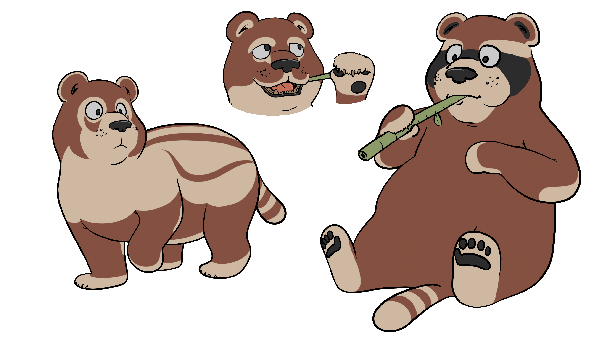

Welcome to our first devlog!

We're excited to share more and more content we're currently working on and a few more in detail aspects of the game. So, first of all, why are we developing around the trainer-creature relation concept?

## The Target

We're doing it for players like us who, as child or young teenagers, loved creature-based games and now feels the need for more realistic and immersive trainer-creature experiences and interactions, in addition to some more adult world building and stories, without losing the cutesy appeal of the genre, but focusing more on player skills and strategic thinking over pure time-based grinding.

And we'd like to achieve these experiences with a slightly different formula than what you would usually expect.

## The Perspective

We're shifting the player perspective from creatures to his/her own in game character, giving creatures their own brains. So the player will need to interact with the creatures as if they were intelligent NPCs instead of just "owning" them and controlling them directly. We hope this alone would bring a lot of interesting quirks and moments during players adventures!

But we're not limiting ourself to that. We strive to give more immersion in the handcrafted world we're going to make, so how to achieve it?

## Stats-less Experience

The idea is to give players more "wow" moments and less creature stats info. After all, in real life, if you own a pet, you don't read how much friendship there is between you both on a info panel, you just *feel* it. The same goes for your in game creatures. You should start knowing them better, created bonding and memories with them, and experience the weak and strong points of everyone without access to info panels all over the place.

Obviously no one should be clueless about what's going on. That's why every feature we're designing for the game is adapted to be felt by the player with in game visuals, effects and hints, that don't ruin the immersion.

And for the final bit, let's talk about creatures, shall we?

## The Creatures

Since the realistic vibes we'd like players to experience, we've chosen to go with realistic looking, animal based and nature focused creatures. We're taking inspiration from a variety of sources of real living species and extinct ones.

Don't worry tough, there's still space for something... *extra*!

And now, here's a sneak preview of what we came up with recently:

I'm happy to introduce you to Burrybear, our first creature concept, who's author, Port, is really proud of. They're based on the [Chapalmania](https://en.wikipedia.org/wiki/Chapalmalania) genus, featuring some body parts taken from pandas, racoons and cats.

One thing to notice, is that there's a natural *evolution* going on from left to right, from young Burrybear and adult ones. That's because there are no straightforward instant evolution based on levels as you'd expect, but a constant and natural growth, based on the activities you'd end up doing with your creatures. This should lead to players actually seeing their creatures growing up with them as time passes.

And now for something a little bit more... familiar:

Doggola is a cat/dog based creature, inspired by Port ideas and designed by Esquilito! It has a unique fur pattern and a particular tuft on their forehead.

We shall state that all the creature concepts are still work in progress and need more polishing before actually be final, but we hope you enjoyed them as we do!

That's it for now, stay tuned for more devlogs coming in the following weeks.

Cheers!