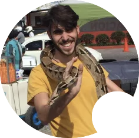

The PWIM project is all about developing a new kind of experience for creature-like games.

The goal of this project is to bring the attention to the trainer-creature relations and focus on making the interactions realistic and meaningful for the gameplay. Iterate over the famous formula in a way that has not been done before and it's not going to happen soon by any big companies out there.

The project started during summer 2022 with a [call to action](https://www.reddit.com/r/INAT/comments/w3evyf/pokémoncreaturelike_project_with_innovative/) in order to assemble an initial team in order to define a GDD and design guidelines for later development. The team has increased ever since, now counting ~20 people involved.

All the work has been done by volunteers with no compensation whatsoever. No plans have been made for monetization yet. The overall starting goal is to lay out the foundation for the game to kickoff actual development. Until then, money is not a priority.

A special *thank you* to all the people that believed in the project and started collaborating with us.

We always need any kind of help. If interested, please contact us via [email](kristiannotari@icloud.com) or on [Discord](discordapp.com/users/760138053908955136).

| | Member | Role |
| - | - | - |
|  | Kristian | :man_office_worker: creator + :bulb: concept |
|  | Luxel | :computer: programmer |
|  | Troyo | :art: 2d |
|  | Port | 🪴 3d |
|  | bluattire | :musical_score: sound/music |
|  | Nahua-Lo | :man_office_worker: moderator |
|  | Spearyt | :crossed_swords: combat designer |
|  | Batman 256 | :pencil: writer |
|  | FireSquid | :computer: programmer |
|  | Friendlyguy | :art: 2d |
|  | awxy | :computer: programmer |
|  | Tarro57 | :musical_score: sound/music |
|  | cntrpl | :video_game: playtesting |
|  | Raijian | :game_die: game design + :computer: programmer + :pencil: writer |
|  | Juliano Josoa |  |
|  | Esquilito | :art: 2d |
|  | Oblivion | 🪴 3d |
|  | Jiangying9 | :game_die: game design + :computer: programmer + :art: 2d |
